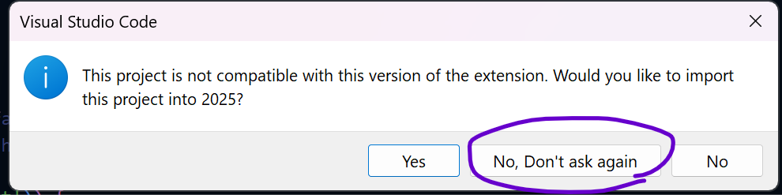
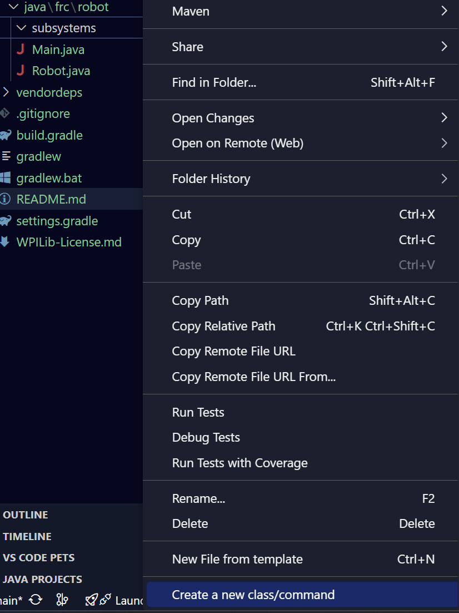

# LED Project

## Instructions
Here's your chance to make something that actually runs on the robot (and hopefully looks pretty slick)!

The goal is to assess your knowledge of Java and programming fundamentals, **not** robot code.
These instructions are *intentionally* pseudocode because the objective is for you to a) recognize and look up terminology you may be unfamiliar with, and b) practice independently exploring code.

When you've completed an exercise, call over a lead so they can check you off.
You're welcome to work with teammates, as long as you understand why your code works.
Ask for help if you get stuck!

You may find [this](https://htmlcolorcodes.com/) helpful.

## Exercises
1. Clone this repository.
2. Create a new branch with your name.

---
# 🚨!! IMPORTANT !!🚨
Right now, the only robot we have available to test this on is Banshee, our robot from the **2024** game Crescendo.
We usually use Banshee for demos, so we need it to be able to run its **2024** code—which also means running the 2024 roboRIO version, 2024 WPILib version, 2024 vendor libraries, etc.
Unfortunately robot code is not backwards compatible, so for now whatever we run on Banshee MUST be compatible with the 2024 version.
(It *is* possible to import old code between years, but it's a bit of a pain so we will not be doing that.)

We can make projects backdated to 2024, though, **which this project is.**
When you open the folder for this project in "2025 WPILib VS Code", you will see a popup asking if you'd like to import the project into 2025.
**Do not import it into 2025.**
Your code will not run.
Click "No, Don't ask again" and you should be able to proceed normally.

---

3. Create a new `LEDSubsystem` class.
- Go to `src/main/java/frc/robot`.    
    Right-click on the `subsystems` folder in the VSCode sidebar and scroll until you see the "Create new class/command" button.
    Click that and select Subsystem from the dropdown.
    Name it `LEDSubsystem`.
    (This is still a class, it just has some boilerplate code filled out for us already)

4. Declare one `AddressableLED` and one `AddressableLEDBuffer` member variable.
- These are the WPILib classes that let us control LEDs.
  You should be prompted to import them once you start typing.
  Initialize the `AddressableLED` with an ID of 3 and the `AddressableLEDBuffer` with a length of 36.
5. In the `LEDSubsystem` constructor, get the length of the `AddressableLEDBuffer` and set the length of the `AddressableLED` to it.
Then, start the `AddressableLED`.
6. Make a new method that sets an individual LED in the buffer to a `Color` (a WPILib class) from its index.
7. Make a method that sets all the LEDs in the buffer to a certain color.
8. Call the method you just created in `periodic()` in the `LEDSubsystem` file and declare a new `LEDSubsystem` member variable in `Robot.java`.
9. Make a method that sets every other LED to purple or white.
10. Make a method that sets the LEDs to a (static) rainbow, then make one that cycles through the rainbow.
11. Challenge: Make a method that sets a short segment of purple lights to "run along" a background of white (optional)
12. Make something fun! :D (optional)

## Deploying Instructions
Connect to the robot wifi network.
Then, open the WPILib Command Palette (the little WPILib logo in the upper right corner of VSCode) and select `WPILib: Deploy Robot Code`.
This sends the code to the robot.
Then, use the NI Driver Station app to enable the robot, which you can download on your device (Windows only), use the designated driver station laptop, or talk to a lead.